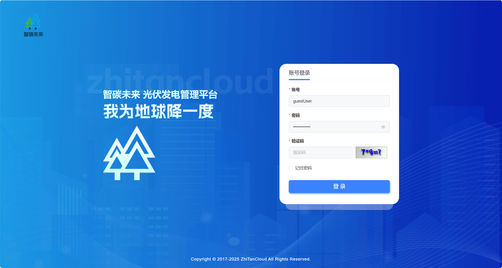
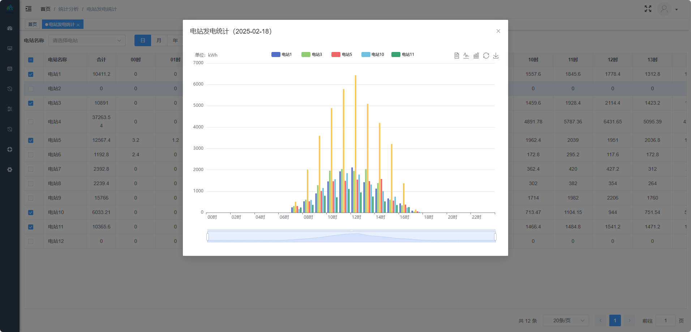

	

<h1 align="center" style="margin: 30px 0 30px; font-weight: bold;">智碳光伏管理系统</h1>

基于若依框架前后端分离版本

光伏平台后台展示&接口已完全开源，代码完备，功能齐全，运行正常

数采和数据清洗部分网上开源的库很多，学习者可以参考友商集成

通过本项目，学习者可以掌握光伏监测管理行业的功能和业务，以及技术架构。

    <a href='https://gitee.com/wang-xiaoming007/zhitan-pv/stargazers'></img></a>
    <a href='https://gitee.com/wang-xiaoming007/zhitan-pv/members'></img></a>

## 平台简介

智碳光伏发电监测管理系统，基于Spring Boot + Vue前后端分离版本。是一种基于物联网、大数据及云计算技术的智能化管理平台，用于实时监控、分析和优化光伏电站的运行状态，旨在提升发电效率、保障系统安全、降低运维成本，并为电站的长期稳定运行提供数据支持。

* 前端采用Vue、Element UI。
* 后端采用Spring Boot、Spring Security、Redis & Jwt。
* 权限认证使用Jwt，支持多终端认证系统。
* 支持加载动态权限菜单，多方式轻松权限控制。
* 高效率开发，使用代码生成器可以一键生成前后端代码。

## 【注意】完整光伏监测管理平台包含三个部分，本仓库只包含光伏监测平台展示端
##### 监测平台展示端：也即本项目光伏平台后台展示部分，代码完备，运行正常。通过本项目，学习者可以掌握光伏监测管理行业的功能和业务，以及技术架构。
##### 数据采集程序：也即mqtt➡️时序库功能，市面上开源库非常多，可参考thingsjs等知名项目，或者自己用netty自己实现。
##### 数据清洗服务：也即时序库➡️关系库，学习者可以使用java自带的XXL job等计划任务工具自己按照业务功能，来实现数据清洗服务。

## 关于问题答疑

#####  因总是有人恶意举报我们仓库，顾我只留下了一个技术交流的微信
#####  我正在把演示demo、logo、截图等也换成了中性的名字，去掉了所有有可能涉及到涉嫌推广的字眼（我们也不知道git被举报的规则是什么。。。）
#####  所以大家如果有更深入的问题，提issue吧。
##

## 在线体验

- guestUser/guest@123456

演示地址：  
https://demo-pv.zhitancloud.com/

## UI展示

首页

首页

电站实时状态

电站发电统计

环比分析

同比分析

峰平谷分析

    
    

    
    
    >

    小程序

## 内置功能

### 1. 实时监测
#### 1.1 实时数据
#### 1.2 电站实时状态
#### 1.3 设备实时状态
### 2. 统计分析
#### 2.1 电站发电统计
#### 2.2 设备发电统计
#### 2.3 同比分析
#### 2.4 环比分析
### 3. 尖峰平谷
#### 3.1 图表统计
#### 3.2 报表统计
### 4. 电能质量
#### 4.1 负荷分析
#### 4.2 三相不平衡分析
#### 4.3 功率因数分析
### 5. 智能报警
### 6. 运维管理
#### 6.1 电站管理
#### 6.2 设备管理
#### 6.3 设备类型管理
#### 6.4 设备点检
#### 6.5 备品备件
#### 6.6 峰平谷配置
### 7. 移动端（小程序）
#### 7.1 首页概览
#### 7.2 实时监测
#### 7.3 智能报警

## 沟通交流

扫码添加微信交流，加微信请备注：pv+姓名。

  

