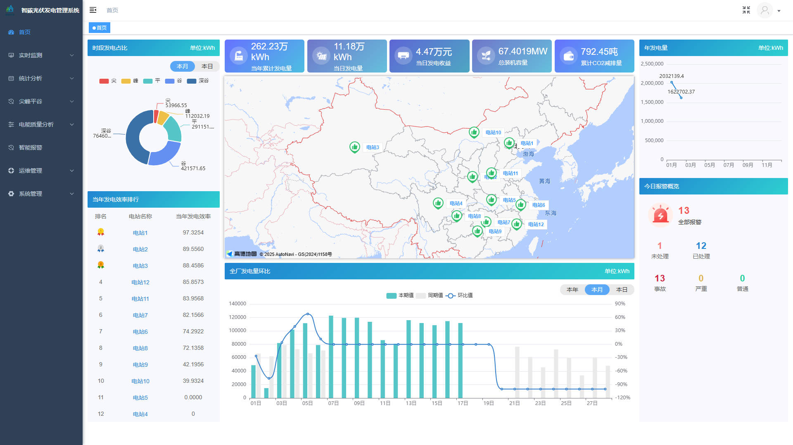
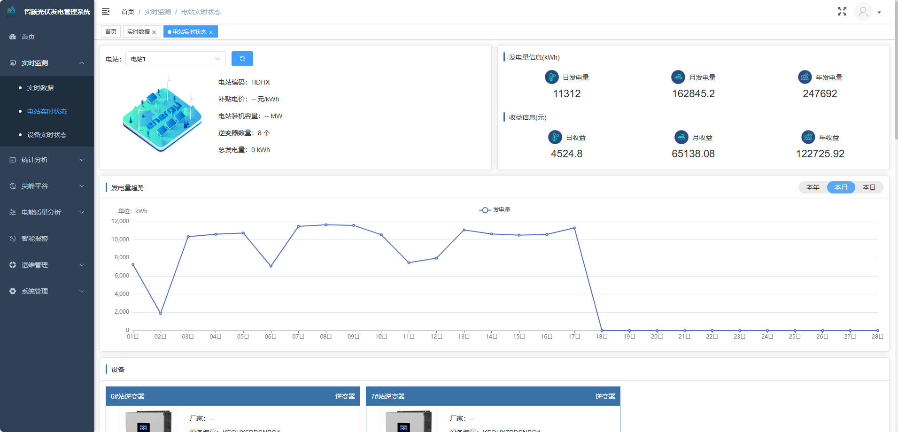
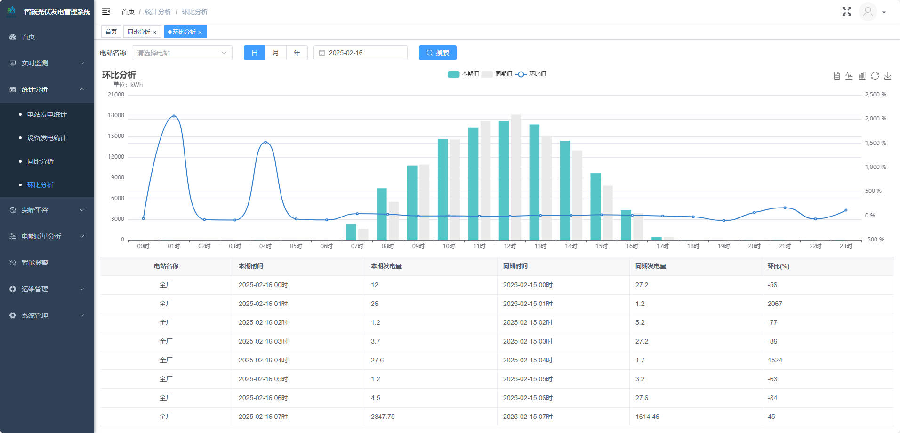
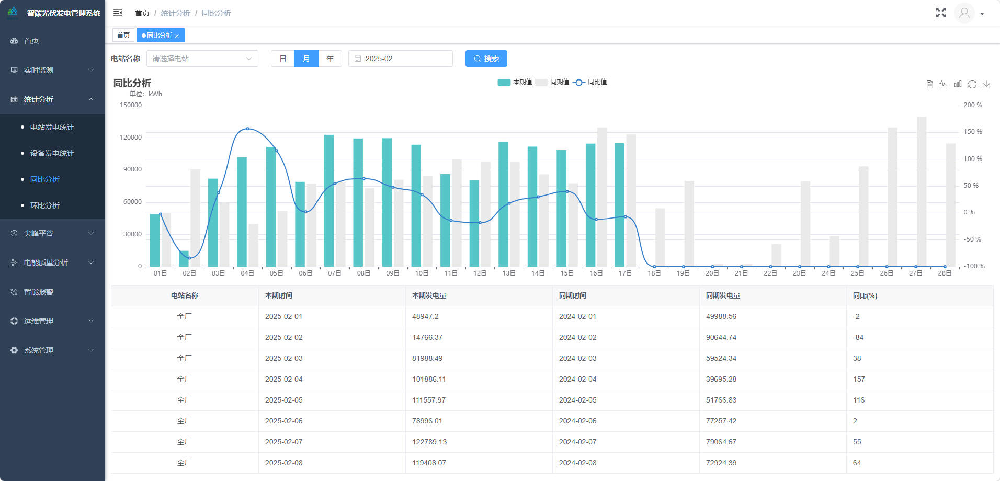
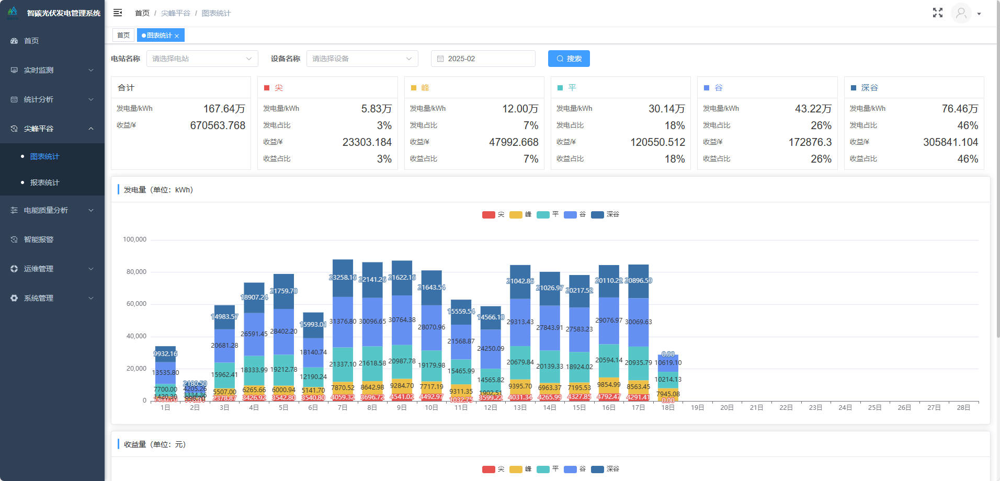
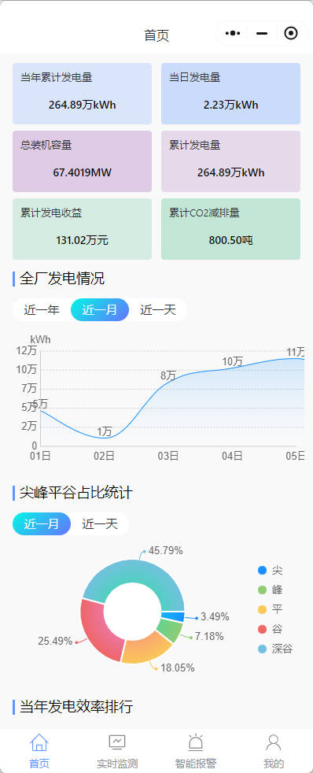
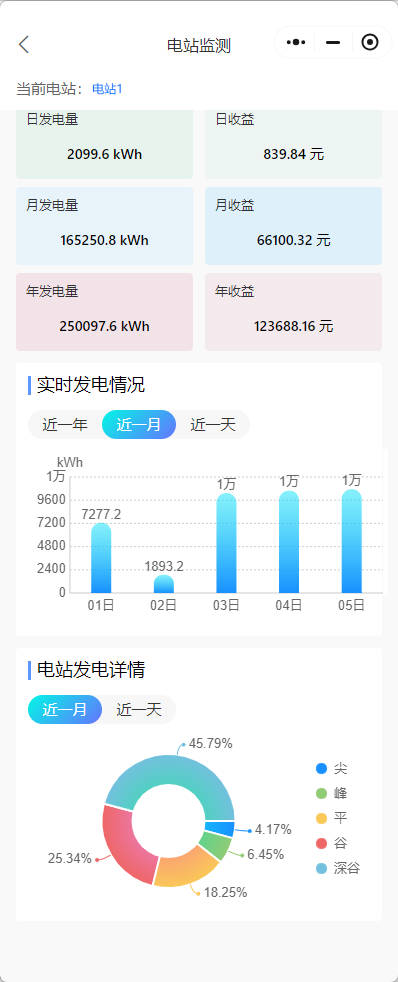
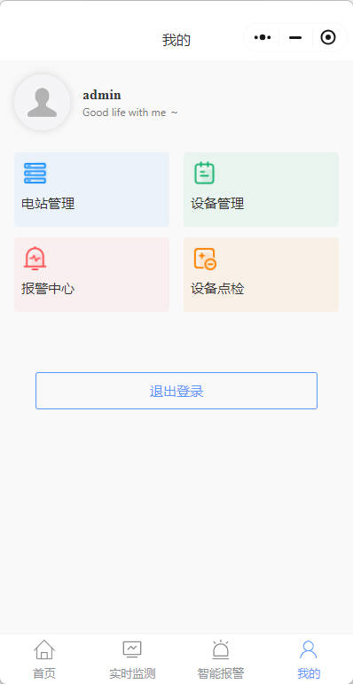
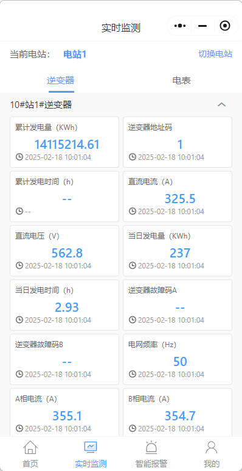
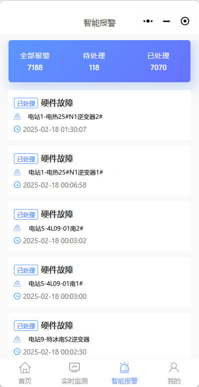

	

<h1 align="center" style="margin: 30px 0 30px; font-weight: bold;">智碳光伏管理系统</h1>
<h4 align="center">基于若依框架前后端分离版本</h4>

    <a href='https://gitee.com/ustcyc/zhitan-pv/stargazers'></img></a>
    <a href='https://gitee.com/ustcyc/zhitan-pv/members'></img></a>

## 平台简介

智碳光伏发电监测管理系统，基于Spring Boot + Vue前后端分离版本。是一种基于物联网、大数据及云计算技术的智能化管理平台，用于实时监控、分析和优化光伏电站的运行状态，旨在提升发电效率、保障系统安全、降低运维成本，并为电站的长期稳定运行提供数据支持。

* 前端采用Vue、Element UI。
* 后端采用Spring Boot、Spring Security、Redis & Jwt。
* 权限认证使用Jwt，支持多终端认证系统。
* 支持加载动态权限菜单，多方式轻松权限控制。
* 高效率开发，使用代码生成器可以一键生成前后端代码。

## 内置功能

### 1. 实时监测
#### 1.1 实时数据
#### 1.2 电站实时状态
#### 1.3 设备实时状态
### 2. 统计分析
#### 2.1 电站发电统计
#### 2.2 设备发电统计
#### 2.3 同比分析
#### 2.4 环比分析
### 3. 尖峰平谷
#### 3.1 图表统计
#### 3.2 报表统计
### 4. 电能质量
#### 4.1 负荷分析
#### 4.2 三相不平衡分析
#### 4.3 功率因数分析
### 5. 智能报警
### 6. 运维管理
#### 6.1 电站管理
#### 6.2 设备管理
#### 6.3 设备类型管理
#### 6.4 设备点检
#### 6.5 备品备件
#### 6.6 峰平谷配置
### 7. 移动端（小程序）
#### 7.1 首页概览
#### 7.2 实时监测
#### 7.3 智能报警

## UI展示

    首页

    电站实时状态 

    环比分析 

    同比分析 

    峰平谷分析 

    小程序

    
    
    
    
    >

## 在线体验

- guestUser/guest@123456

演示地址：  
http://pvadmin.zhitancloud.com/

## 沟通交流

扫码添加微信交流，加微信请备注：pv。

  

